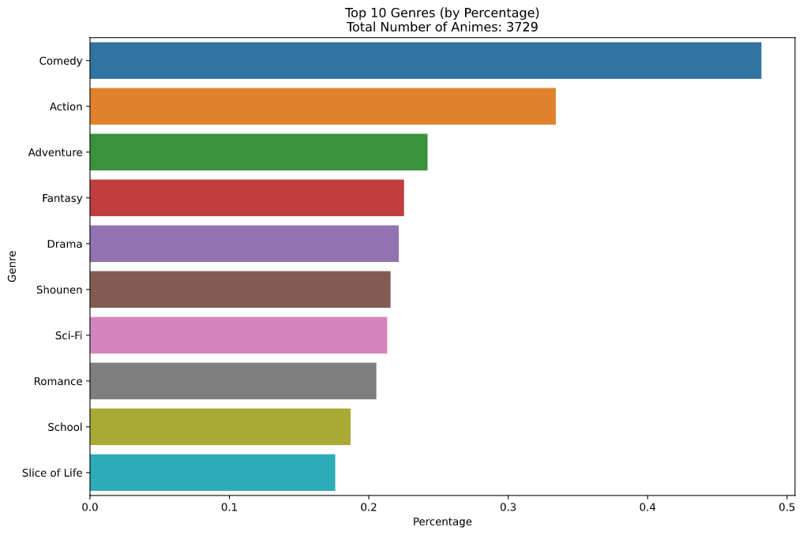
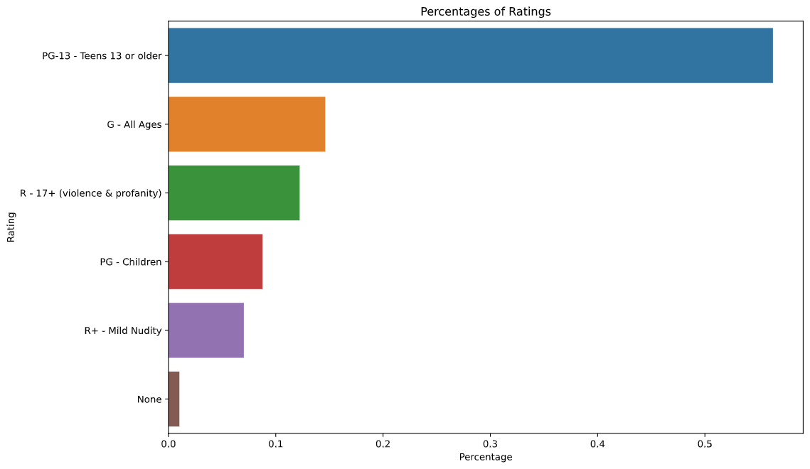
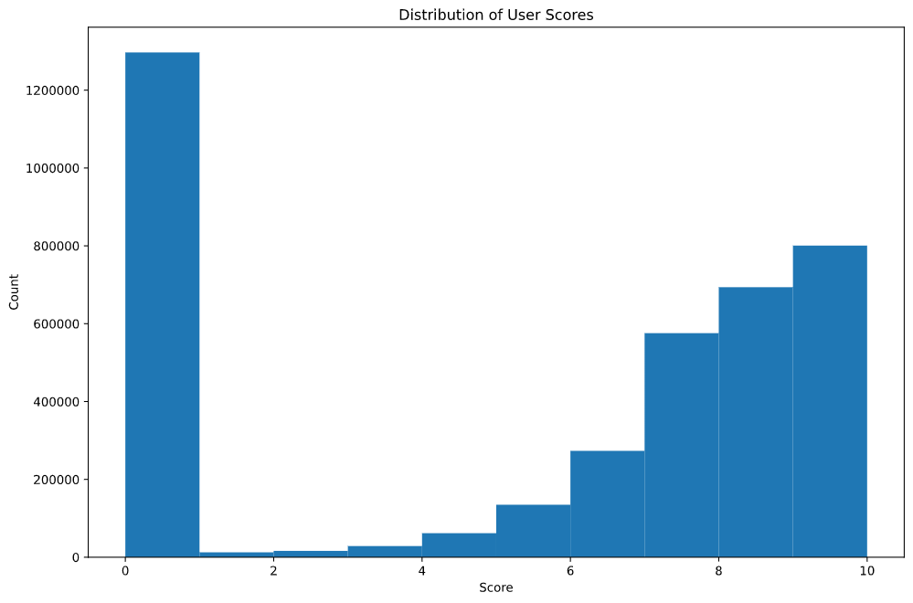
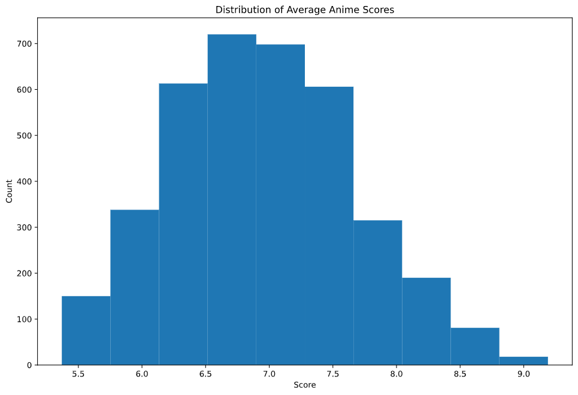

# Anime Recommender

## Table of Contents

- [Problem Statement](#Problem-Statement)
- [Executive Summary](#Executive-Summary)
- [Project Directory](#Project-Directory)
- [Data Collection](#Data-Collection)
- [EDA](#EDA)
- [Modeling](#Modeling)
- [Conclusion](#Conclusion)
- [Future Improvements](#Future-Improvements)
- [References](#References)

---

# Problem Statement

[MyAnimeList](https://myanimelist.net/), often abbreviated as MAL, is an anime and manga social networking and social cataloging application website run by volunteers.<sup>[1]</sup> Although the website has a great amount of anime data, it lacks a data driven recommender system. The current recommendation section is just a list of user recommendation submissions (e.g. "If you like anime 'X', you will like anime 'Y'"), which are often very subjective and limited in the number of recommendations per anime title. So I decided to create a recommender system using the users' list of anime scores (collaborative filtering) and anime metadata (content-based recommender using NLP on genres and synopsis description). The goal is to provide better recommendations to MyAnimeList users via flask app.

# Executive Summary

I created a hybrid of content-based and collaborative item-item recommender using the data scraped from MyAnimeList. The content based recommender is created from a vectorized matrix using anime titles' genres and synopsis description. Cosine similarity scores are calculated from this vectorized matrix, and the recommendations are generated based on similarity scores. Similarly, the collaborative recommender is created from a pivot table of scores with anime title indices and username columns. Cosine similarity scores are calculated from this pivot table, and the collaborative recommendations are generated based on similarity scores. The flask app allows the user to choose the weight on content-based recommender and collaborative recommender, and the final recommendations are shown based on the sum of weighted similarity scores.

# Project Directory

NOTE: `data` directory is not included in this repository because some data files exceed over 100 MB (github's maximum file size limit).

Source for [`background.jpeg`](https://i.imgur.com/HKHi8sW.jpeg)

```
📜README.html
📜requirements.txt
📜.gitignore
📦app
┣ 📂static
┃ ┣ 📂styles
┃ ┃ ┣ 📜index.css
┃ ┃ ┗ 📜results.css
┃ ┗ 📜background.jpeg
┣ 📂templates
┃ ┣ 📜index.html
┃ ┗ 📜results.html
┗ 📜main.py
📦assets
┣ 📜anime_score_distribution.png
┣ 📜rating_percentage.png
┣ 📜top_genres.png
┗ 📜user_score_distribution.png
📦code
┣ 📜01_scrape_anime.py
┣ 📜02_scrape_user.py
┣ 📜03_extract_user_lst.py
┣ 📜notebook.ipynb
📦data
┣ 📜top_anime.json
┣ 📜user_cleaned.csv
┗ 📜user_lst.json
```

# Setup

1. Clone this repo
2. Run `01_scrape_anime.py` in `code` directory
3. Run `02_scrape_user.py` in `code` directory
4. Run `03_extract_user_lst.py` in `code` directory
5. Run `main.py` in `app` directory to host flask app

# Data Collection

I used a library called `jikanpy` which is a Python wrapper for [Jikan API](https://jikan.docs.apiary.io/#), an open-source PHP & REST API for MyAnimeList. Due to request limits in Jikan API, scraping scripts have 2-4 second delays between requests.

First, I created a script called `01_scrape_anime.py` which scrapes anime metadata from top 10,000 animes (by average review score). This script saves a json file called `top_anime.json` in the data directory, and this file is used for creating the content-based recommender. This script may run for several hours.

Then, I created a script called `02_scrape_user.py` which scrapes users' information including each specific user's anime review scores. **Important note:** Jikan API does not provide a complete list of usernames, but it allows you to get a list of usernames from specific "clubs" in MyAnimeList. The three clubs that I chose to get the list of usernames are:

- [Recommendation Club](https://myanimelist.net/clubs.php?cid=20081)
- [The Newbie Club](https://myanimelist.net/clubs.php?cid=20081)
- [Anime Paradise Club (A.P.C.)](https://myanimelist.net/clubs.php?cid=67029)

The main reason for choosing these clubs is that these clubs are very neutral in anime preference. However, I must acknowledge that anime preference of the users from these clubs may not be a good overall representation of anime preference of the total MyAnimeList userbase. Therefore, the collaborative recommender may be somewhat biased towards animes liked by users in the clubs mentioned above. If you wish to change the list of clubs to scrape usernames from, you can do so by editing `club_list` variable in `02_scrape_user.py` file in the code directory. The output of this script is `user_lst.json` file, and the file may be several gigabytes in size, and the script may run for several days depending on the total number of usernames for all the clubs in `club_list` variable.

Finally, I created a script called `03_extract_user_lst.py` which extracts core information from `user_lst.json` file created from `02_scrape_user.py`. Because `user_lst.json` file is very large (over 4.5 GB), it's not possible to load the json file using the standard `json` library with limited memory. Therefore, I had to use the `ijson` library which allows users to parse through large json files to collect certain information. The output of this script is `user_cleaned.csv` file which is used for creating the collaborative recommender.

# Exploratory Data Analysis

- Total number of unique animes: 3,729
- Total number of unique users: 24,575
- Total number of user reviews: 3,894,501









# Modeling

The final recommender is a combination of two recommenders: content-based recommender and collaborative recommender. Both recommenders are based on cosine similarity equation. Cosine similarity is a measure of similarity between the two non-zero vectors of an inner produce space <sup>[2]</sup>.


**Content-based recommender**: Natural Language Processing (NLP) is used to create vectorized matrix on animes' genres and synopsis descriptions. TF-IDF vectorized matrix of synopsis descriptions and dummified matrix of genre titles are concatenated together, and cosine similarity is calculated with the concatenated matrix. The content-based recommender takes in the name of the anime and returns a list of recommended animes based on the similarity scores. 

**Collaborative recommender**: A pivot table of scores with anime title indices and username columns are created, and cosine similarity is calcualted with this pivot table. The collaborative recommender  laso takes in the name of the anime and returns a list of recommended animes based on the similarity scores. 

**Hybrid recommender**: Cosine similarity scores of each anime from content-based recommender and collaborative recommender are applied with user-specified weight and returns a list of recommended animes based on the sum of these weighted similarity scores.  

# Conclusion

Compared to pure content-based recommender, pure collaborative recommender generally recommends more highly rated animes especially when given an anime with high average score. While these recommendations may be suitable for new anime watchers, they may not be very suitable for long time anime watchers. On the other hand, content-based recommender recommends animes that are similar on genres and synopsis description, so its top recommendations are often prequels or sequels regardless of their overall quality. Also, because content-based recommender does not take in account of the scores, it often recommends more poorly rated animes than the collaborative recommender. 

When equal weights were applied to content-based recommendations and collaborative recommendations, the final recommendation seemed to still slightly favor content-based recommendations since cosine similarity values for content-based recommendations are generally higher than that of collaborative recommendations. I found applying more weight towards collaborative recommendation generally produced the most balanced results with a good mix of highly rated animes and "unexpected" animes.  

# Future Improvements

There are many improvements that can be made on both the front-end side and back-end side of the flask app. Besides improving the overall appearance of the flask app, adding more functionalities would greatly improve the user experience. For example, the current recommender only accepts exact anime titles as the input so implementing an auto-complete would greatly help users search for specific anime titles. Allowing users to choose certain genres or ratings (e.g. making R+ ratings animes to not show up on recommendations) would also greatly increase the overall recommendation quality. 

On the back-end side, experimenting with different kinds of recommender system could potentially increase the recommendation quality. There are many libraries that can be used to make more sophisticated recommenders including [Surprise](https://surprise.readthedocs.io/en/stable/) library and neural network libraries like [TensorFlow](https://www.tensorflow.org/recommenders). Adding an user-item recommender system would also increase the recommendation quality since its recommendations will be customized for different users. Additionally, introducing penalties for animes rated lower than a certain threshhold score would mitigate the effect of recommending very poorly rated animes. 

Currently, both the data and the flask app are are hosted locally. However, local hosting poses a lot of potential problems. Migrating the whole structure to a single or multiple cloud platforms would greatly make the app more stable and accessible to users. Finally, Jikan API showed its flaws in speed and stability. Coming up with a better data collection method would save time, and creating cron jobs to periodically update anime data would eliminate the need to manually run data collection scripts. 

# References

\[1\]: https://en.wikipedia.org/wiki/MyAnimeList <br>
\[2\]: https://en.wikipedia.org/wiki/Cosine_similarity
